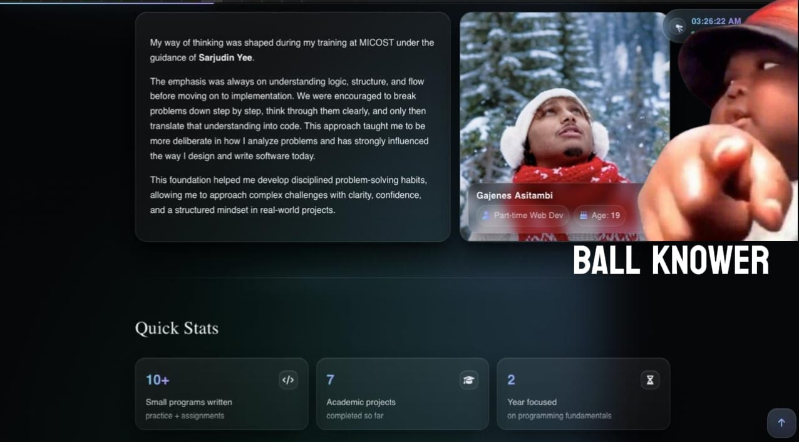
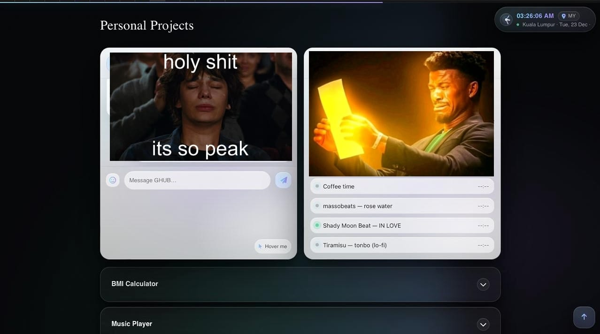

<!-- ===================== Animated Header ===================== -->
<p align="center">
  
</p>

<!-- ===================== Badges ===================== -->
<p align="center">
  
  
  
  
</p>

<!-- ===================== Web Icon ===================== -->
<p align="center">
  <a href="https://www.reddit.com/r/webdev/" target="_blank" rel="noreferrer">
    
  </a>
</p>

<h1 align="center">Portfolio Website — Gajee</h1>

<p align="center">
A modern, animated <b>personal portfolio website</b> built with <b>HTML, CSS, and vanilla JavaScript</b>, featuring
a clean dark theme, smooth UI interactions, and responsive layout design.
</p>

---

## 📸 Screenshots

<p align="center">
  
  
</p>

---

## 🧠 About the Website

This portfolio is a single-page site that showcases:
- A hero section with animated typing text and quick navigation links :contentReference[oaicite:4]{index=4} :contentReference[oaicite:5]{index=5}
- Smooth scrolling with active section highlighting :contentReference[oaicite:6]{index=6}
- A scroll progress bar + “back to top” interaction :contentReference[oaicite:7]{index=7}
- A mini Malaysia clock + Kuala Lumpur micro-map panel (OpenStreetMap embed) :contentReference[oaicite:8]{index=8}
- Responsive layouts and polished card-based UI styling :contentReference[oaicite:9]{index=9}

---

## ✨ Key Features

- ✅ Dark theme with gradient “aurora” styling and clean typography :contentReference[oaicite:10]{index=10}
- ✅ Typing animation (cycling lines) in the hero section :contentReference[oaicite:11]{index=11}
- ✅ Scroll progress indicator + back-to-top button :contentReference[oaicite:12]{index=12}
- ✅ Section observer (auto-highlights the active nav link) :contentReference[oaicite:13]{index=13}
- ✅ Mini map panel for Kuala Lumpur (OpenStreetMap iframe + external open link) :contentReference[oaicite:14]{index=14}
- ✅ Uses Google Fonts (Inter + Playfair Display) and Font Awesome icons :contentReference[oaicite:15]{index=15}

---

## 🛠️ Technologies Used

| Technology | Purpose |
|----------|---------|
| HTML5 | Structure / sections |
| CSS3 | Theme, layout, animations, responsiveness |
| JavaScript | Typing effect, scroll progress, section highlight |
| Font Awesome | Icons :contentReference[oaicite:16]{index=16} |
| Google Fonts | Typography :contentReference[oaicite:17]{index=17} |

---

## 📂 How to Run

### Option 1: Open directly
1. Download / clone the repo
2. Open `index.html` in your browser

### Option 2: Run with a local server (recommended)
```bash
# Python 3
python -m http.server 8000
